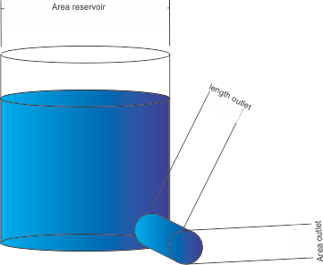

# Introduction
During the exercises on Finite Differences, you have experienced several times that the model can become instable or at least can start oscillating. Often, this could be resolved with decreasing the time step over which the calculation was performed. This is, however, a rather expensive solution, because a smaller time step means many more calculations while maybe, this smaller time step is not needed throughout the complete simulation period. Therefore, adaptive time stepping schemes exist; when needed, a smaller time step is taken, and when not needed, the time step is increased again.  

# The model 
We will implement an adaptive time stepping scheme for the most simple model we dealt with; the emptying reservoir without input. 




*Single linear reservoir with outlet properties.*  

# First assignment
Implement an adaptive time stepping scheme. For this, you have to define criteria for when the time step has to decrease (and how much). This can be based on the difference between two schemes. However, you don't want to do the same calculation twice, because then you might as well half the step size directly. Therefore, use two schemes where one scheme is an intergral part of the other scheme. The simplest example is Euler Forward and Heun's Method. Heun's Method looks as follows:

$$\widetilde{s}= s(t) + \Delta t f(t,s(t))$$

Where $\tilde{s}$ is a sub-step equal to Euler Forward. Subsequently, $t+\Delta t$ is obtained as:
$$ s(t+\Delta t)= s(t) + \frac{\Delta t}{2}(f(t,s(t))+f(t+\Delta t,\widetilde{s}))$$


Another option is for instance the Cash-Karp method, where two Runge-Kutta schemes are compared. Implement the schemes, define an error tolerance, and adapt the time step when the error exceeds this tolerance. Compare your results to the analytical solution, to evaluate the trade-off between error and number of evaluations-. 

# Second assignment
Conduct a sensitivity analysis. 
- Decide for yourself whether you want to conduct a local or global sensitivity analysis.
- Decide on which parameters you want to conduct sensitivity analysis - the parameters from the reservoir, or the parameters of your adaptive time stepping scheme, or both and their interaction? 

# Further exploration
You are free to explore any other questions that arise with the model. For example:
- Use variable input, such as the Hupsel data from assignment 6, week 1. What are the water balance errors and do these decrease with a variable time stepping scheme? 
- What happens to the results if you add complexity to my model? (e.g. by introducing a second outlet)
- What is the relation between time steps and parameter sensitivity?

$$s(t + \Delta t)=s(t)+\dfrac{\Delta t}{A}
\left(Q_{in}-\alpha_{res.up}(s(t)-level_{res.up})-\alpha_{res.lw}\:s(t)\right)\\$$


```{R}
# Calculate water level in reservoir using Euler Forward and Heun's Method
# Compare the absolute difference between Euler Forward and Heun's Method
# If difference is smaller than tolerance, the result from Heun's method is accepted
# If difference is larger than tolerance, it recalculates using 
# new time step = old time step * factor
# until the difference is smaller than tolerance

# Function: calculate_euler_forward_method
#
# Purpose:
#   Calculates the next state of the system using the Euler Forward method.
#
# Parameters:
#   state - The current state of the system (numeric).
#   dt    - The time step to be used for calculation (numeric).
#   A     - The area parameter of the reservoir (numeric).
#   alpha - The decay constant (numeric).
#
# Returns:
#   The next state of the system after applying the Euler Forward method (numeric).

calculate_euler_forward_method = function(state, dt=dt, area=A, alpha=alpha) {
    forward = state + dt/A *(-alpha * state)
    return(forward)
}


# Function: calculate_heuns_method
#
# Purpose:
#   Calculates the next state of the system using Heun's method.
#
# Parameters:
#   state - The current state of the system (numeric).
#   dt    - The time step to be used for calculation (numeric).
#   A     - The area parameter of the reservoir (numeric).
#   alpha - The decay constant (numeric).
#
# Returns:
#   The next state of the system after applying Heun's method (numeric).

calculate_heuns_method = function(state, dt=dt, area=A, alpha=alpha) {
    s_tilde= state + dt/A *(-alpha * state)
    newstate = state + dt/(2*A) *((-alpha*state)  - alpha * s_tilde) 
    return(newstate)
}


# Function: compare_methods
#
# Purpose:
#   Compares the results of the Euler Forward method and Heun's method to determine
#   the difference between these two approaches for a given state and time step.
#
# Parameters:
#   state - The current state of the system (numeric).
#   dt    - The time step to be used for calculation (numeric).
#   A     - The area parameter of the reservoir (numeric).
#   alpha - The decay constant (numeric).
#
# Returns:
#   The absolute difference between the results of the Euler Forward method
#   and Heun's method (numeric).

compare_methods = function(state, dt=dt, area=A, alpha=alpha) {
    euler_forward = calculate_euler_forward_method(state, dt, A, alpha)
    heuns_method = calculate_heuns_method(state, dt, A, alpha)
    difference = abs(heuns_method - euler_forward)
    return(difference)
}


# Function: simulate_reservoir
#
# Purpose:
#   Simulates the behavior of an emptying reservoir over a specified time period 
#   using adaptive time stepping.
#
# Parameters:
#   begin_time    - The starting time of the simulation (numeric).
#   end_time      - The ending time of the simulation (numeric).
#   dt_start      - The initial time step for the simulation (numeric).
#   initial_state - The initial state of the reservoir (numeric).
#   A             - The area parameter of the reservoir (numeric).
#   alpha         - The decay constant (numeric).
#   factor        - The factor by which to adjust the time step (numeric).
#   tolerance     - The tolerance level for adjusting the time step (numeric).
#
# Returns:
#   A list containing two elements:
#     - time: A vector of time steps at which the state was calculated (numeric).
#     - state: A vector of states of the reservoir at each time step (numeric).

simulate_reservoir = function(begin_time, end_time, dt_start, initial_state, A, alpha, factor, tolerance) {
    # Initialize variables
    time = begin_time
    result_state = c(initial_state)
    result_time = c(time)
    current_state = initial_state

    # Simulation loop
    while(time < end_time) {
        dt = dt_start
        while (compare_methods(current_state, dt, A, alpha) > tolerance) {
            dt = dt * factor
        }
        current_state = calculate_heuns_method(current_state, dt, A, alpha)
        result_state = c(result_state, current_state)
        time = time + dt
        result_time = c(result_time, time)
    }

    return(list(time = result_time, state = result_state))
}

# Define the parameters
begin_time = 0
end_time = 50
dt_start = 5
initial_state = 3
A = 4.0
alpha = 1.5
factor = 0.8
tolerance = 0.01

# Run the simulation
simulation_results = simulate_reservoir(begin_time, end_time, dt_start, initial_state, A, alpha, factor, tolerance)

# Extract results for plotting and further analysis
result_time = simulation_results$time
result_state = simulation_results$state


# Analytical solution
time_sequence = seq(begin_time,end_time, by=0.1)
analytic_state=initial_state * exp(-time_sequence*alpha/A)

# state of analytical solution to compare with numerical solution at every time step
analytic_state_at_discrete_time_step=initial_state * exp(-result_time*alpha/A)

# Plotting
plot(result_time, result_state,type='o', xlab="time", ylab="state", col="blue")
lines(result_time, analytic_state_at_discrete_time_step, col='grey', lwd=2)
title(main='Emptying reservoir')
grid()

# Number of function evaluations
num_eval = length(result_time)

#global_truncation_error = 

# Error at each time step
analytical_comparison = abs(analytic_state_at_discrete_time_step - result_state)

# Root-mean-square deviation
RMSD = sqrt(sum(analytical_comparison^2)/length(analytical_comparison))
print(paste("The root mean square deviation is:", RMSD))
```

Calculate total error in the whole domain
```{R}
# Install package for area under curve
if (!"DescTools" %in% installed.packages()) {install.packages("DescTools")}
library(DescTools)

# Calculate with area under curve
area_under_numercial_curve = AUC(result_time, result_state)
area_under_analytical_curve = AUC(time_sequence, analytic_state)
print(paste0("The absolute and percentage difference between analytical and numerical solution is: ", 
            abs(area_under_numercial_curve - area_under_analytical_curve), " and ", 
            abs(area_under_numercial_curve - area_under_analytical_curve) / area_under_analytical_curve * 100, "%"))
print(paste("The number of evaluations is", num_eval))
```
# Global sensitivity analysis
```{R}
source("samplehelpers.R")

base_global = list(A = A, alpha = alpha)
scale_global = list(A = 0.05 * A, alpha = 0.05 * alpha)

parnames = names(base_global)
parmeans = unlist(base_global)
parsd    = unlist(scale_global)

parlower = c(3.5, 1)
parupper = c(4.5, 2)
samplesize = 100
set.seed(237)
parsample = GaussianLHS(samplesize,parmeans,parsd,parnames,parlower,parupper) 

head(parsample)
summary(parsample)
plot(parsample,cex=0.4)

old.par = par(no.readonly=TRUE)
par(mfrow=c(1,2))
hist(parsample[,"A"],main="",col="lightblue",prob=TRUE)
rug(parsample[,"A"],col="red")
lines(density(parsample[,"A"]),col="red",lwd=2)
hist(parsample[,"alpha"],main="",col="lightblue",prob=TRUE)
rug(parsample[,"alpha"],col="red")
lines(density(parsample[,"alpha"]),col="red",lwd=2)
```

```{R}
statesSample = matrix(0,ncol=length(result_time),nrow=0)
timeSample = matrix(0,ncol=length(result_time),nrow=0)

# Define the parameters
begin_time = 0
end_time = 50
dt_start = 5
initial_state = 3
factor = 0.8
tolerance = 0.01

# point to evaluate
points_for_evaluation = c(0:50)

simulation_results_approx = matrix(0,ncol=length(points_for_evaluation),nrow=0)

# start the for-loop through the parameter sample 
for(i in 1:nrow(parsample))
  {
    A = parsample[i,"A"] 
    alpha = parsample[i,"alpha"]
    
# Run the simulation
simulation_results = simulate_reservoir(begin_time, end_time, dt_start, initial_state, A, alpha, factor, tolerance)

# Extract results for plotting and further analysis
result_time = simulation_results$time
result_state = simulation_results$state

linear_interpolation = approxfun(result_time, result_state)
simulation_results_approx = rbind(simulation_results_approx,linear_interpolation(points_for_evaluation))

# Analytical solution
time_sequence = seq(begin_time,end_time, by=0.1)
analytic_state=initial_state * exp(-time_sequence*alpha/A)

# state of analytical solution to compare with numerical solution at every time step
analytic_state_at_discrete_time_step=initial_state * exp(-result_time*alpha/A)

# Plotting
# plot(result_time, result_state,type='o', xlab="time", ylab="state", col="blue")
# lines(result_time, analytic_state_at_discrete_time_step, col='grey', lwd=2)
# title(main='Emptying reservoir')
# grid()

# Number of function evaluations
num_eval = length(result_time)

# Error at each time step
analytical_comparison = abs(analytic_state_at_discrete_time_step - result_state)

# Root-mean-square deviation
RMSD = sqrt(sum(analytical_comparison^2)/length(analytical_comparison))
print(paste("The root mean square deviation is:", RMSD))
print(paste("The number of evaluations is", num_eval))
statesSample = rbind(statesSample,simulation_results$state)
timeSample = rbind(timeSample,simulation_results$time)
  }

```

```{R}
# Install package 
if (!"matrixStats" %in% installed.packages()) {install.packages("matrixStats")}
library(matrixStats)
matplot(t(timeSample),t(statesSample),type="l",main="States for all parameter sets",ylab="water level")
matplot(points_for_evaluation,t(simulation_results_approx),type="l",main="States for all parameter sets",ylab="water level")
```

```{r, animation.hook="gifski", interval = 0.3}

for (i in c(2:length(points_for_evaluation))) {
  MPsample = cbind(M=simulation_results_approx[,i],parsample)
  plot(MPsample[,"A"], MPsample[,"M"], main=paste("Value of A versus model results with conditional expectation at t =", i-1), ylim = c(0,3))
  McondA = linloess(M~A,data=MPsample)
  points(MPsample[,"A"],McondA,pch=20,col="red")
}
```


```{r, animation.hook="gifski", interval = 0.3}

for (i in c(2:length(points_for_evaluation))) {
  MPsample = cbind(M=simulation_results_approx[,i],parsample)
  plot(MPsample[,"alpha"], MPsample[,"M"], main=paste("Value of alpha versus model results with conditional expectation at t =", i-1), ylim = c(0,3))
  Mcondalpha = linloess(M~alpha,data=MPsample)
  points(MPsample[,"alpha"],Mcondalpha,pch=20,col="red")
}

```


```{R, animation.hook="gifski", interval = 0.3}
variance_A = c()
variance_alpha = c()
variance_model = c()
  
for (i in c(2:length(points_for_evaluation))) {
  MPsample = cbind(M=simulation_results_approx[,i],parsample)
  VARM = var(simulation_results_approx[,i])
  variance_model = c(variance_model, VARM)
  SDM = sd(simulation_results_approx[,i])
  ANOVA1 = sample.vardecomp(MPsample)
  variance_A = c(variance_A, ANOVA1[[1]])
  variance_alpha = c(variance_alpha, ANOVA1[[2]])
  
  added_var <- 0
  for (j in c(1:length(ANOVA1))) {
  added_var <- added_var + ANOVA1[j]
}
  pie(ANOVA1,
    main=paste("Variance of M =", VARM, "at t =", i-1, 
               "\nRemaining variance is", VARM - added_var),
    col = rainbow(5),
    radius=1)
}

if (!"ggplot2" %in% installed.packages()) {install.packages("ggplot2")}
library(ggplot2)

# create a dataset
condition <- (c(rep("A", length(points_for_evaluation) - 1), rep("alpha", length(points_for_evaluation) - 1)))
value <- c(abs(variance_A/variance_model), abs(variance_alpha/variance_model))
time <- c(1:(length(points_for_evaluation)-1), 1:(length(points_for_evaluation)-1)) 
data <- data.frame(time, condition, value) 

# Stacked
ggplot(data, aes(fill=condition, y=value, x=time)) +
  geom_bar(position="stack", stat="identity")

temp_data = data.frame(time = c(1:(length(points_for_evaluation)-1)), model_variance = variance_model)
ggplot(temp_data,  aes(y=model_variance, x=time)) +
  geom_line()
```


```{R}


```


```{R}


```
# With fixed input
```{R}
# # System functions
# g_explicit = function(time, state)
# {
#   return(state + dt/A*((sin(time)+1)-alpha*state))
# }
# 
# g_implicit = function(time, state)
# {
#   return(state+dt/2*(((sin(time)+1-alpha*state)/A)+(sin(time)+1-alpha*g_explicit(time+dt,state))/A))
#   
# }
# 
# sys.fun = function(state)
# {
#   # s.aux    = g_explicit(time     , state)
#   newstate = g_implicit(time, state)
#   return(newstate)
# }
# 
# 
# # Initial parameter values
# begin.time = 0     # usually this variable is set to 0
# end.time   = 50    # end time of the simulation 
# dt         = 2.5   # delta t; time discretisation 
# init.state = 3     # state of the system at the beginning of the simulation 
# 
# # reservoir parameter values
# A         = 4.0   # area
# alpha     = 1.5  # decay constant
# 
# # Simulation initialisation
# time = begin.time
# result.state = c(init.state)
# result.time = c(time)
# current.state = init.state
# 
# # Simulation
# while(time < end.time)
# {
#     current.state = sys.fun(current.state)
#     result.state = c(result.state,current.state)
#     time = time + dt
#     result.time = c(result.time,time)
# }
# 
# # Analytical solution
# # time.sequence = seq(begin.time,end.time, by=0.1)
# # analyt.state=init.state * exp(-time.sequence*alpha/A)
# 
# 
# 
# 
# # Plotting
# plot(result.time, result.state,type='o', xlab="time", ylab="state")
# lines(time.sequence, analyt.state, col='grey', lwd=2)
# dt = 0.1 # a new dt value to evaluate current scheme
# time = begin.time
# result.state = c(init.state)
# result.time = c(time)
# current.state = init.state
# while(time < end.time)
# {
#   current.state = sys.fun(current.state)
#   result.state = c(result.state,current.state)
#   time = time + dt
#   result.time = c(result.time,time)
# }
# lines(result.time,result.state,type='o',col='blue', lwd=0.1)
# title(main='Emptying reservoir with input')
# grid()
# 
# # Number of function evaluations
# num_eval = length(result.time)
# 

```